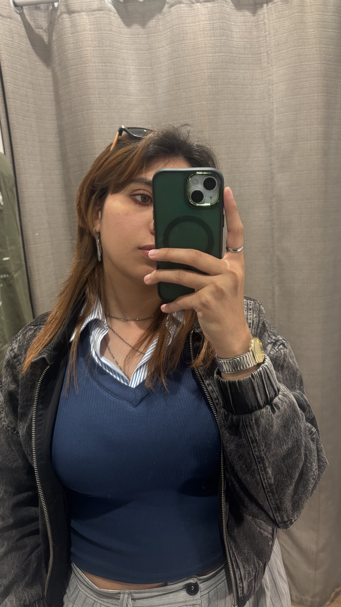

<p align="center">
  
</p>

# 🌟 Portafolio Personal - Abigail Vargas Argüello

Portafolio web personal desarrollado con Laravel Blade y CSS personalizado, presentando información profesional, habilidades técnicas, intereses y objetivos de carrera.

## 📋 Descripción

Este proyecto es un portafolio web que muestra mi perfil profesional como estudiante de Ingeniería en Sistemas con especialización en ciberseguridad. El sitio incluye información sobre mi formación, habilidades técnicas y creativas, intereses personales y metas profesionales.

## ✨ Características

- **Diseño Responsive**: Adaptable a dispositivos móviles, tablets y escritorio
- **CSS Personalizado**: Sin frameworks externos como Bootstrap
- **Navegación Intuitiva**: Menú funcional entre las diferentes secciones
- **Paleta de Colores Moderna**: Combinación profesional de púrpura, rosa y verde
- **Animaciones Suaves**: Transiciones y efectos hover elegantes
- **Organización Clara**: Información estructurada en 4 vistas principales

## 🗂️ Estructura del Proyecto

```
portafolio-personal/
│
├── resources/
│   └── views/
│       ├── perfil.blade.php        # Información personal
│       ├── intereses.blade.php     # Pasatiempos y gustos
│       ├── habilidades.blade.php   # Skills técnicas y creativas
│       └── metas.blade.php         # Objetivos profesionales
│
├── public/
│   └── css/
│       └── estilos.css             # Estilos personalizados
│
└── README.md
```

## 📄 Secciones del Portafolio

### 1. 📋 Perfil (perfil.blade.php)
Información personal básica:
- Nombre completo
- Edad
- Ocupación actual
- Presentación personal

### 2. 💡 Intereses (intereses.blade.php)
Mis principales pasatiempos:
- 🔒 **Ciberseguridad**: Análisis forense y protección de sistemas
- 🎮 **Videojuegos**: Desarrollo y análisis de mecánicas
- 🎨 **Arte**: Dibujo digital y tradicional
- 🎵 **Música**: Producción musical y composición

### 3. 🚀 Habilidades (habilidades.blade.php)
Skills organizadas por categorías:

**Lenguajes de Programación:**
- C# (Avanzado)
- Python (Avanzado)
- Kotlin (Intermedio)

**Herramientas:**
- Unity (Desarrollo de videojuegos)
- FL Studio (Producción musical)

**Habilidades Creativas:**
- Dibujo
- Escritura

### 4. 🎯 Metas (metas.blade.php)
Objetivos profesionales:
- **Meta Principal**: Trabajar en informática forense para una entidad pública
- **Meta Personal**: Formar una banda musical

## 🎨 Características de Diseño

### Paleta de Colores
```css
--color-primario: #6366f1      /* Púrpura índigo */
--color-secundario: #ec4899    /* Rosa */
--color-acento: #10b981        /* Verde esmeralda */
--color-fondo: #f8fafc         /* Gris claro */
--color-texto: #1e293b         /* Gris oscuro */
```

### Elementos Visuales
- Barras de progreso animadas
- Tarjetas con efecto hover
- Gradientes suaves
- Sombras sutiles
- Iconos emoji para mejor comprensión visual

## 🛠️ Tecnologías Utilizadas

- **Laravel Blade**: Motor de plantillas
- **CSS3**: Estilos personalizados
- **HTML5**: Estructura semántica
- **Flexbox & Grid**: Sistema de diseño responsive

## 📦 Instalación

### Requisitos Previos
- PHP >= 7.4
- Composer
- Laravel >= 8.x

### Pasos de Instalación

1. **Clonar el repositorio**
```bash
git clone https://github.com/tu-usuario/portafolio-personal.git
cd portafolio-personal
```

2. **Instalar dependencias**
```bash
composer install
```

3. **Copiar archivo de entorno**
```bash
cp .env.example .env
```

4. **Generar clave de aplicación**
```bash
php artisan key:generate
```

5. **Copiar archivos al proyecto**
   - Coloca los archivos `.blade.php` en `resources/views/`
   - Coloca `estilos.css` en `public/css/`

6. **Iniciar servidor de desarrollo**
```bash
php artisan serve
```

7. **Acceder a la aplicación**
```
http://localhost:8000
```

## 🚀 Configuración de Rutas

Agrega las siguientes rutas en `routes/web.php`:

```php
Route::get('/', function () {
    return view('perfil');
});

Route::get('/perfil', function () {
    return view('perfil');
})->name('perfil');

Route::get('/intereses', function () {
    return view('intereses');
})->name('intereses');

Route::get('/habilidades', function () {
    return view('habilidades');
})->name('habilidades');

Route::get('/metas', function () {
    return view('metas');
})->name('metas');
```

## 📱 Responsive Design

El sitio está optimizado para:
- 📱 **Móviles**: < 480px
- 📱 **Tablets**: 481px - 768px
- 💻 **Desktop**: > 768px

## 🎯 Características CSS

### Sistema de Grid
```css
display: grid;
grid-template-columns: repeat(auto-fit, minmax(280px, 1fr));
gap: 1.5rem;
```

### Efectos de Transición
```css
transition: all 0.3s ease;
```

### Barras de Progreso Animadas
Las barras de habilidades se animan al cargar la página, mostrando visualmente el nivel de competencia en cada skill.

## 🔧 Personalización

### Cambiar Colores
Edita las variables CSS en `estilos.css`:
```css
:root {
    --color-primario: #tu-color;
    --color-secundario: #tu-color;
    --color-acento: #tu-color;
}
```

### Modificar Contenido
Edita directamente los archivos `.blade.php` en `resources/views/`

## 📈 Mejoras Futuras

- [ ] Agregar modo oscuro
- [ ] Implementar sistema de contacto
- [ ] Añadir galería de proyectos
- [ ] Integrar blog personal
- [ ] Agregar sección de certificaciones
- [ ] Implementar multiidioma (ES/EN)
- [ ] Añadir formulario de contacto funcional
- [ ] Integrar animaciones más complejas con JavaScript


## 👤 Autor

**Abigail Vargas Argüello**

- Estudiante de Ingeniería en Sistemas
- Especialización en Ciberseguridad
- Intereses: Informática Forense, Desarrollo de Software, Arte y Música

## 📧 Contacto

¿Preguntas o sugerencias? No dudes en contactarme:

- 📧 Email: abivargasargu17@gmail.com
- 💼 LinkedIn: https://www.linkedin.com/in/abigail-vargas-argüello-a6224236b/
- 🐙 GitHub: https://github.com/Lyanna17


⭐ Si este proyecto te resulta útil, no olvides darle una estrella en GitHub!

**Desarrollado con ❤️ y ☕ por Abigail Vargas Argüello**